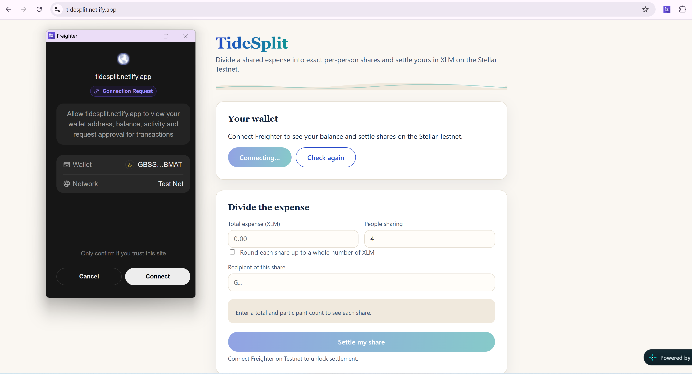
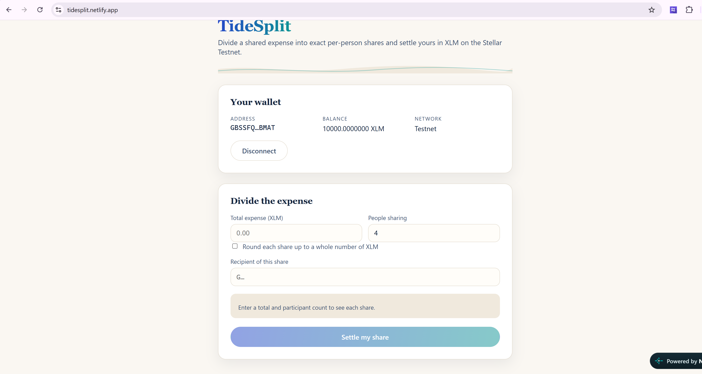
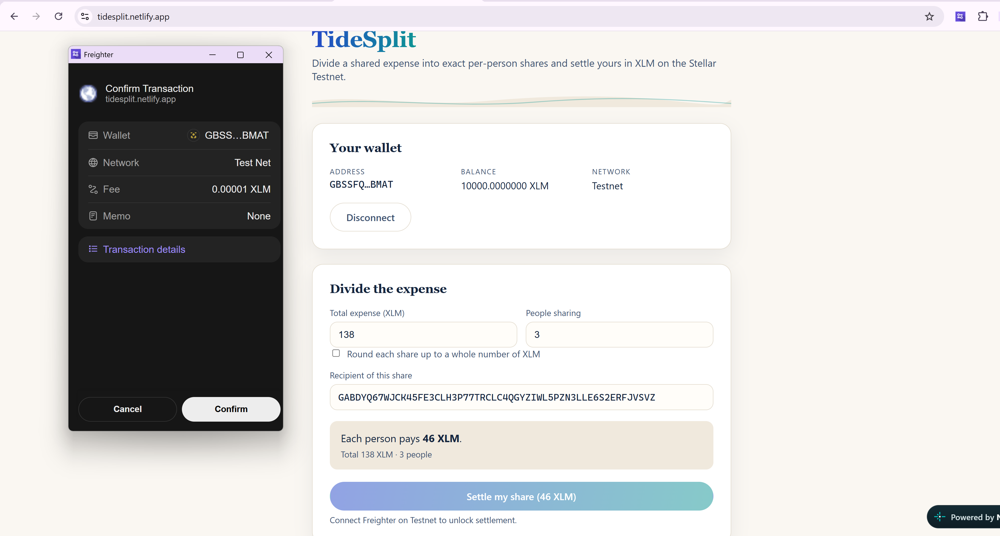
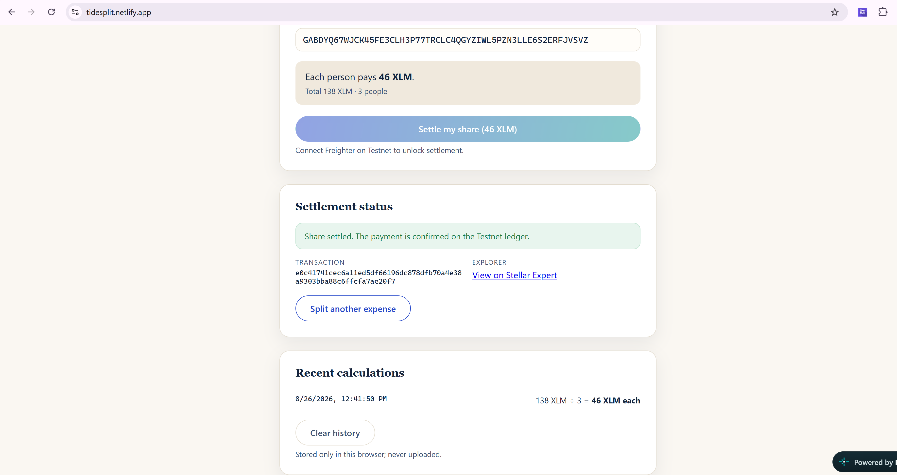
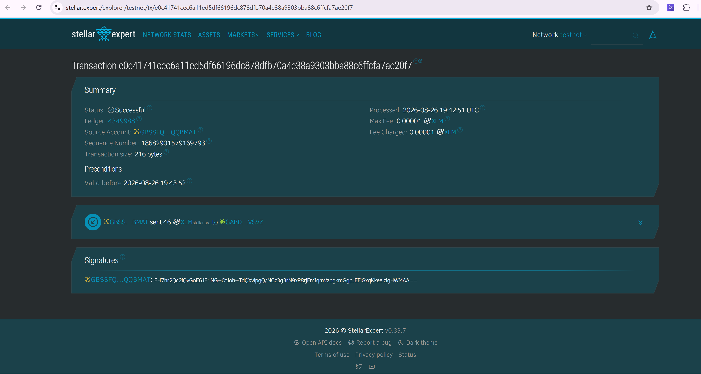

# TideSplit

TideSplit divides a shared expense into exact per-person shares and settles
one computed share in XLM on the Stellar Testnet. The calculation summary and
the payment receipt sit at the center of the experience — what you see is
precisely what gets submitted.

> ⚠️ **Testnet only.** TideSplit talks exclusively to the Stellar Testnet.
> Funds come from the free friendbot faucet and carry no real-world value.

## Live App

[Launch TideSplit](https://tidesplit.netlify.app/)

## Features

- Freighter connection with an explicit Testnet network guard
- Live XLM balance with loading / ready / unfunded / unreachable states
- Expense inputs: total, participant count, optional whole-XLM rounding
- Transparent calculation summary showing the exact per-person share
- Stroop-precision arithmetic (integer math) — never NaN, never Infinity
- Settlement through a signed XLM payment with signing → submitting →
  confirmed/failed receipt states
- Transaction hash plus Stellar Expert explorer link on success
- Distinct messages for: missing wallet, declined access, declined signing,
  wrong network, invalid recipient, insufficient balance, malformed
  transaction, and Horizon outages
- Duplicate-settlement lock while a transaction is in flight

## Prerequisites

- Node.js 18+ and npm 9+
- [Freighter](https://www.freighter.app/) installed and set to **Test Network**
- A funded Testnet account (visit `https://friendbot.stellar.org/?addr=<YOUR_PUBLIC_KEY>` once)

## Local Setup

```bash
git clone https://github.com/sealedsplash/tidesplit-stellar.git
cd tidesplit-stellar
npm install
npm run dev
```

Open `http://localhost:5174` in the browser where Freighter is installed.

## Environment Variables

None. The Horizon Testnet URL is fixed in source so the app cannot point at
Mainnet by misconfiguration.

## Scripts

| Command             | What it does                    |
| ------------------- | ------------------------------- |
| `npm run dev`       | Vite dev server on port 5174    |
| `npm run build`     | Typecheck + production bundle   |
| `npm test`          | Vitest unit tests               |
| `npm run lint`      | ESLint                          |
| `npm run typecheck` | Standalone TypeScript check     |

## Architecture

```
src/
├── components/            # WalletPanel, SplitPanel, SettlementReceipt, WaveDivider
├── hooks/
│   ├── useWalletSession.ts   # Connection phase machine + balance states
│   └── useSettlement.ts      # Build/sign/submit lifecycle + receipt record
├── split/
│   ├── calculator.ts         # Integer stroop arithmetic for even division
│   └── validation.ts         # Inline form rules with explanatory messages
├── wallet/
│   ├── freighterAdapter.ts   # Typed Freighter result wrapper
│   └── horizonClient.ts      # Balance reads + settlement submission
└── styles/                # Theme tokens, layout, controls
```

Secret keys never touch the app: unsigned envelopes go to Freighter, and only
signed envelopes are submitted to Horizon.

## Screenshots

### Freighter connection request



### Connected wallet and XLM balance



### Calculated share awaiting signature



### Successful Testnet settlement



### Stellar Expert confirmation



## Verified Example Transaction

- Transaction hash: `e0c41741cec6a11ed5df66196dc878dfb70a4e38a9303bba88c6ffcfa7ae20f7`
- Explorer link: [View on Stellar Expert](https://stellar.expert/explorer/testnet/tx/e0c41741cec6a11ed5df66196dc878dfb70a4e38a9303bba88c6ffcfa7ae20f7)
- Payment: `46 XLM` on Stellar Testnet

## Troubleshooting

| Symptom | Resolution |
| --- | --- |
| "No Freighter extension detected" | Install from freighter.app and reload. |
| Wrong-network banner | Switch Freighter to Test Network and press Check again. |
| "Unfunded account" | Claim faucet XLM for your address, then reconnect. |
| Signing declined | Nothing was sent; adjust the share and settle again. |

## License

MIT
